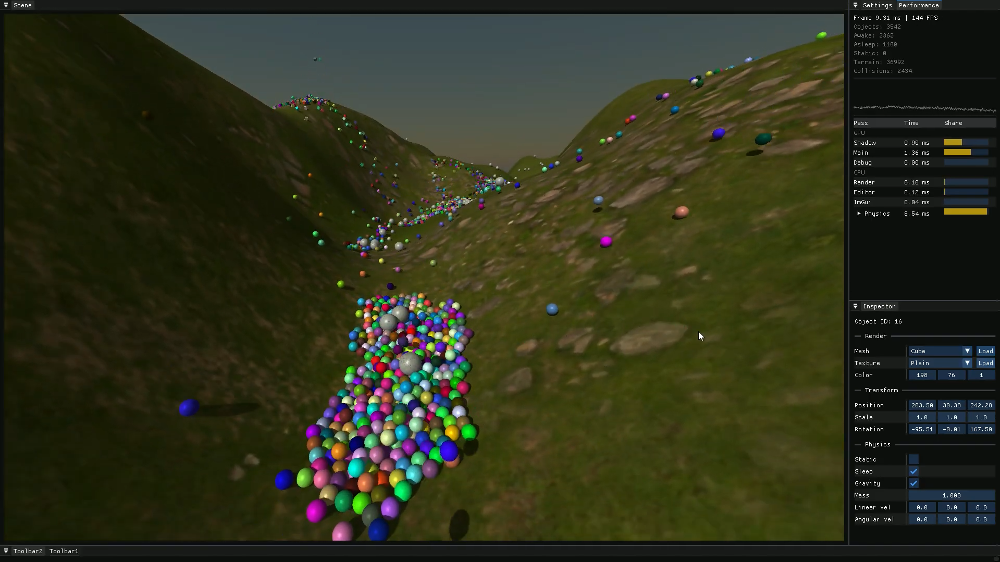

# opengl_engine
A lightweight C++/OpenGL real-time engine built from scratch with a focus on physics, performance, and handling many objects in real time.

## Terrain stress test with many objects, showcasing BVH-based broad-phase acceleration (including terrain BVH) for efficient collision queries at scale.

## 1) General
**opengl_engine** (name subject to change) is a personal engine project focused on building core real-time systems end-to-end. It’s primarily a learning + experimentation repository: features evolve quickly, APIs may change, and the main goal is to iterate on design, performance, and debuggability—especially for physics-heavy scenes with lots of objects.

## 2) Physics
- Custom rigid body simulation (`rigid_body`, `physics`, `physics_world`)
- Broad-phase collision management (`broadphase_manager`, `broadphase_pairs`)
- BVH acceleration structures, including terrain support (`bvh`, `bvh_terrain`, `treetree_query`)
- Narrow-phase collision detection using SAT (`sat`)
- Collision manifolds + contact generation with multi-contact support (`collision_manifold`)
- Sleeping/awake handling to reduce simulation cost in large scenes (integrated in the physics update flow)
- Raycasting utilities (`raycast`)
- Collider primitives: AABB, OOBB, sphere, triangle (`aabb`, `oobb`, `sphere`, `tri`, `collider`)

## 3) Renderer
- OpenGL renderer responsible for scene drawing (`renderer`)
- Shader system + built-in GLSL shaders (`shader_manager`, `default`, `shadow`, `skybox`, debug shaders)
- Mesh loading and asset management (`mesh_loader`, `mesh_manager`, `mesh`)
- Texture handling (`texture_manager`)
- Lighting and shadow systems (`light`, `light_manager`, `shadow_manager`)
- Debug rendering utilities for visualizing engine state (AABB/OOBB, normals, lines, contact points, etc.)  
  (`aabb_renderer`, `oobb_renderer`, `normals_renderer`, `draw_line`, `render_contact_points`, `arrow_renderer`, ...)

## 4) Editor
- Editor UI and integration (`editor_main`, `imgui_manager`)
- Panel framework + built-in panels (`panel`, `panel_manager`, `inspector_panel`, `performance_panel`, `settings_panel`)
- Viewport rendering infrastructure (`viewport_fbo`)
- Interaction workflows intended to support fast iteration while developing the engine (inspection + debug visualization + picking/raycast integration)
