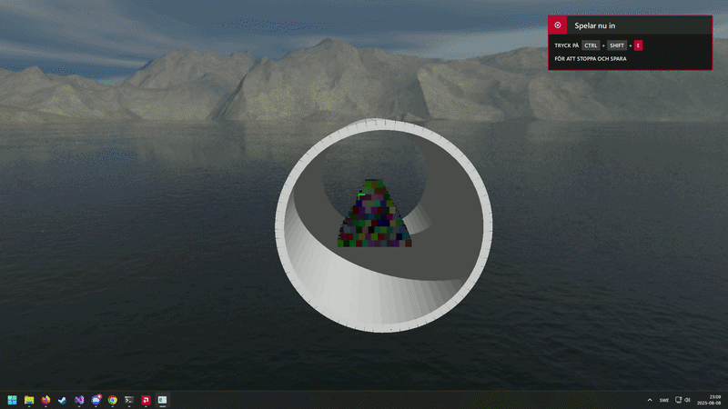
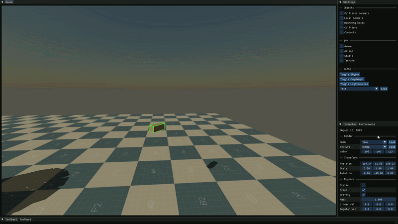

# opengl_engine
A lightweight C++/OpenGL real-time engine built from scratch with a focus on physics, performance, and handling many objects in real time.

## Demos (click to watch on YouTube)

<table>
  <tr>
    <td align="center">
       
      <b>Pyramid stack</b>
    </td>
    <td align="center">
       
      <b>Terrain + BVH debug</b>
    </td>
    <td align="center">
       
      <b>Physics based tumbler</b>
    </td>
  </tr>

  <tr>
    <td align="center">
       
      <b>Object manipulation</b>
    </td>
    <td align="center">
       
      <b>Object inspector</b>
    </td>
    <td align="center">
       
      <b>Debug visualizations</b>
    </td>
  </tr>
</table>

## 1) General
**opengl_engine** (name subject to change) is a personal engine project focused on building core real-time systems end-to-end. It’s primarily a learning + experimentation repository: features evolve quickly, APIs may change, and the main goal is to iterate on design, performance, and debuggability - especially for physics-heavy scenes with lots of objects.

## Build & Run
- Platform: **Windows**
- IDE: **Visual Studio** (open `opengl_engine.sln`)
- Recommended: **x64 / Release**

Dependencies (GLFW/GLAD/GLM/ImGui/stb) are vendored under `opengl/Linking/`.

## Controls

<table>
  <tr>
    <td valign="top" width="33%">
      <b>Global</b>
      <table>
        <tr><td>Toggle UI</td><td><b>F1</b></td></tr>
        <tr><td>Toggle Editor / Player</td><td><b>V</b></td></tr>
        <tr><td>Pause physics</td><td><b>G</b></td></tr>
        <tr><td>Step (paused)</td><td><b>F</b></td></tr>
      </table>
    </td>

    <td valign="top" width="33%">
      <b>Editor</b>
      <table>
        <tr><td>Mouse look (viewport)</td><td><b>Hold RMB</b></td></tr>
        <tr><td>Move camera</td><td><b>W/A/S/D</b></td></tr>
        <tr><td>Up / Down</td><td><b>E / Q</b></td></tr>
        <tr><td>Faster movement</td><td><b>Hold LShift</b></td></tr>
        <tr><td>Select / raycast</td><td><b>LMB</b></td></tr>
        <tr><td>Drag selected</td><td><b>Hold LMB</b></td></tr>
        <tr><td>Manipulate selected</td><td><b>Hold LMB + RMB</b></td></tr>
        <tr><td>Toggle placement AABB</td><td><b>1</b></td></tr>
        <tr><td>Object rain (cubes)</td><td><b>2</b></td></tr>
        <tr><td>Object rain (spheres)</td><td><b>3</b></td></tr>
        <tr><td>Sleep all</td><td><b>4</b></td></tr>
        <tr><td>Awaken all</td><td><b>5</b></td></tr>
        <tr><td>Shoot spheres</td><td><b>Hold MB4</b></td></tr>
      </table>
    </td>

    <td valign="top" width="33%">
      <b>Player</b>
      <table>
        <tr><td>Move</td><td><b>W/A/S/D</b></td></tr>
        <tr><td>Jump</td><td><b>Space</b></td></tr>
        <tr><td>Select / drag</td><td><b>LMB</b></td></tr>
        <tr><td>Place object</td><td><b>RMB</b></td></tr>
        <tr><td>Shoot object</td><td><b>MB4</b></td></tr>
      </table>
       
      In player mode, mouse look is always enabled (cursor captured).
    </td>
  </tr>
</table>

## 2) Physics
- Custom rigid body simulation (`rigid_body`, `physics`, `physics_world`)
- Broad-phase collision management (`broadphase_manager`, `broadphase_pairs`)
- BVH acceleration structures, including terrain support (`bvh`, `bvh_terrain`, `treetree_query`)
- Narrow-phase collision detection using SAT (`sat`)
- Collision manifolds + contact generation with multi-contact support (`collision_manifold`)
- Sleeping/awake handling to reduce simulation cost in large scenes (integrated in the physics update flow)
- Raycasting utilities (`raycast`)
- Collider primitives: AABB, OOBB, sphere, triangle (`aabb`, `oobb`, `sphere`, `tri`, `collider`)

## 3) Renderer
- OpenGL renderer responsible for scene drawing (`renderer`)
- Shader system + built-in GLSL shaders (`shader_manager`, `default`, `shadow`, `skybox`, debug shaders)
- Mesh loading and asset management (`mesh_loader`, `mesh_manager`, `mesh`)
- Texture handling (`texture_manager`)
- Lighting and shadow systems (`light`, `light_manager`, `shadow_manager`)
- Debug rendering utilities for visualizing engine state (AABB/OOBB, normals, lines, contact points, etc.)  
  (`aabb_renderer`, `oobb_renderer`, `normals_renderer`, `draw_line`, `render_contact_points`, `arrow_renderer`, ...)

## 4) Editor
- Editor UI and integration (`editor_main`, `imgui_manager`)
- Panel framework + built-in panels (`panel`, `panel_manager`, `inspector_panel`, `performance_panel`, `settings_panel`)
- Viewport rendering infrastructure (`viewport_fbo`)
- Interaction workflows intended to support fast iteration while developing the engine (inspection + debug visualization + picking/raycast integration)

## License
MIT (see `LICENSE`).
